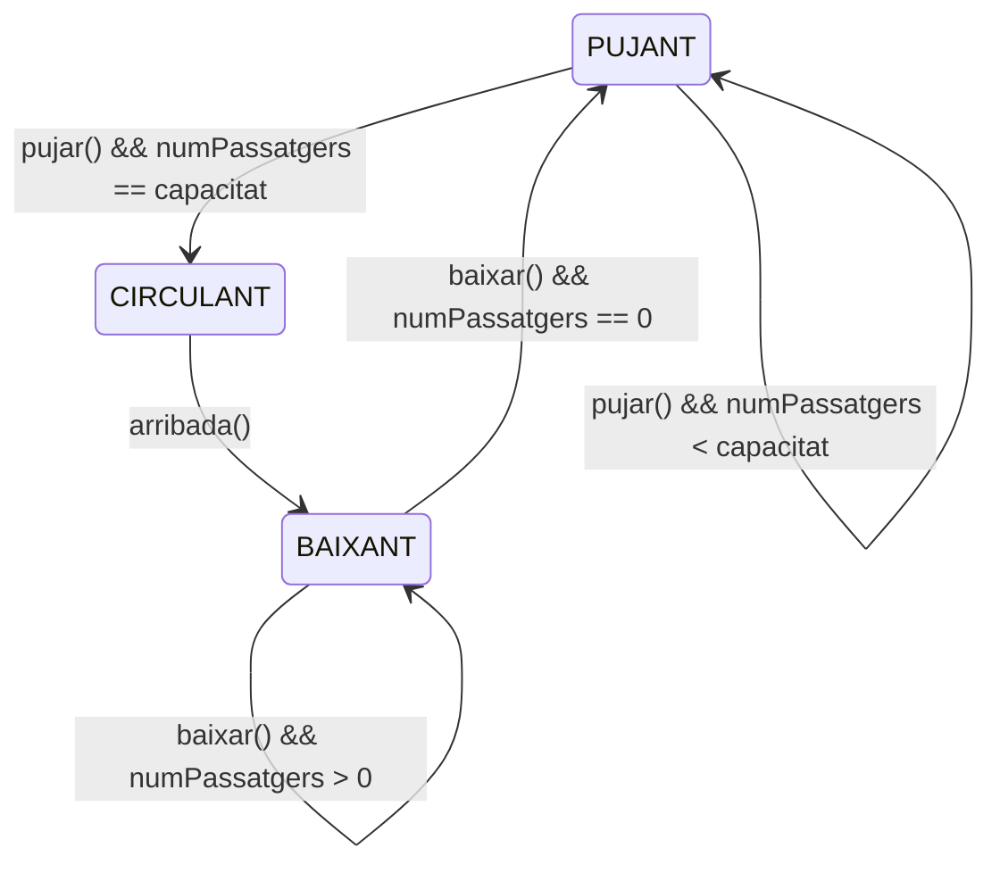

El viatge s'inicia quan el número de passatgers és igual a la capacitat del vagó

No poden pujar nous passatgers fins que TOTS els del viatge anterior han baixat

La classe Passatger crida a les funcions pujar() i baixar()
La classe Vagó crida a les funcions arrencar() i arribada()
El monitor es diu MuntanyaRussa
Nota: no importa l'ordre de pujada, només hi ha un vago.

Aquest problema te un aspecte de:
- Agrupar --> n'hi ha una barrera: fins que tots els passatgers no hagin pujat es bloqueja el programa
- Control --> al baixar del vagó has de bloquejar als threads que intentin pujar i deixar baixar a tots els que havien entrat (preferencia als passatgers dins del vagó)

Aquí el recurs compartit es pot veure com el vagó, i el problema radica en deixar passar un número exacte de persones al recurs i alliberar el mateix nombre de persones de forma mutualment exclusiva.

- En Lectors-Escriptors només decidies qui podia accedir al recurs d'un en un
- En GroupEx s'exclouen els threads entrants sense tenir en compte els que ja has deixat passar.

Però com podem identificat el problema en aquests estats distints (pujant i baixant) i sense oblidar-nos la transició entre aquests (circulant), n'hi ha una manera més elegant de descriure el problema, i és amb una màquina d'estats finita

Nota: la funció arrencar no apareix perquè no canvia l'estat de la màquina, només s'espera fins que l'estat canviï a CIRCULANT.